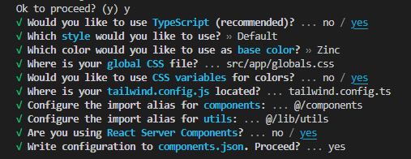

This is going to be a evolving document with shortcuts I want to keep a note of from various youtube tutorials. 📓

**Compilation of VSCode Tips:**

 - Use pnpm its much faster and takes lesser space than npm 

 - Set `emmet balance:outwards` as `ctrl+M` to select the whole html inside a tag use

 - `LShift ctrl + P` when auto import doesnt work and select developer reload window, should work 90% of the time

 - `shift alt arrow down` will copy the same line of code below, useful when making lists

 - Select a word  and then press  `ctrl + D`  and will allow you to change that specific word in all places at the same time. Pretty neat!

 

**Shadcn Settings:**

