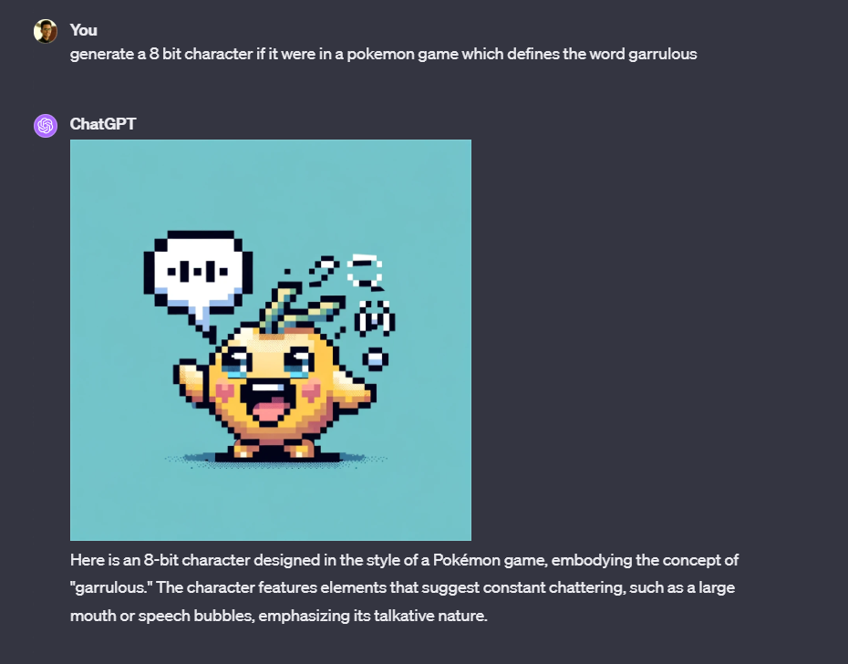

Hello Everyone!

I'm embarking on a journey to take the GRE, which has inspired me to develop an app called VocabVerse. Building this as a part of the 4-week accelerator program, [backdrop build](https://backdropbuild.com/). 

Inspirations: I've drawn inspiration from platforms like Obsidian, and the Word of the Day app.

Competitors: All test prep companies, magoosh, vocabulary apps, Quizlet

My aim is to create a fun and engaging app for vocabulary learning!

I've decided to document my VocabVerse journey here:

**11/09:** Today, I focused on WordNet. Opting for larger NLP models seemed like overkill for this task. I believe the success of this product will hinge on its user experience. The goal is to meld Obsidian's graph view with a user-focused learning experience, utilizing modern AI applications.

**11/10:** Had an enlightening conversation with two fellow builders during a talk. One is developing a multilingual MBA program app using open-source materials, and the other is working on a crypto-based health records system for privacy-concerned doctors. The latter, though a bit complex and proprietary, was particularly intriguing. One of them uses Obsidian, which aligns well with my project. It's time to get cracking on the demo.

**11/11:** Watched this insightful video: [Link to Steve's Video on Builder.io]. It reinforced my belief in using AI judiciously – it's crucial to distinguish my product from something that could be generically created by OpenAI. It's not just about feeding data into a black box; it's about creating something unique and tailored.

**11/12:** Completed the first week's update!

**11/14:** Reflecting on the relatively slow progress last week, I'm keen to follow a tutorial and start building more rigorously. React-force graph seems like the right choice. Also, inspired by the Word of the Day app, I plan to incorporate beautiful visuals using Stability AI. Need to explore how Backdrop can aid in this.

**11/15:** Okay we are going to continue building out the ui with Josh. What a video, built out a nice landing page, added authentication using Kinde. Also tested Dall-E outputs for images and sample sentences, will test stability as well. Want to get to developing the dashbaord by weekend. Will try build out the other parts and setup a backend by weekend! Pushing changes to a new repo - vacabverse-v2. Once I get to the dashboard, will merge both the repos. (not the best practice)

**11/16:** Okay this is awkward. I was coding last night and I just went online and started looking for user reactions to how everyone studies for the GRE and I'm realising that the vocabulary building market is just too saturated and there are some very beautiful apps out there. No doubt my app might be better but I want to make something that I myself will use but also useful to others. One thing I am using LLMs for is my MBA prep and I had this idea long back of helping students navigate through this jhourney for minimum price. MBA is just super expensive, everything from consultants to application costs, so if I can proiovide a service to just help people navigate through this journey, liike a perosnal MBA AI integrated notion, that would actually be very helpful for me as well and an interesting project to build. Let's see, will continue building this product and backend but damn it, I might pivot. Let's see. Also looked into the event sponsors and I think pxie can be perfect to build a chatbot.

https://shop.careerprotocol.com/ai-powered-school-scouting-toolkit/

**11/17:**  So I had applied to Y combinator with this nascent idea but got my rejection letter today! Great, but I have an idea now which might actually get me excited to work on now. I AM GOING TO MAKE A GAME!! The MBA idea is not bad to be honest, but given all the frustrations in my real-life regarding applications, I dont want to spend more time on it. I want to make something fun and omg as fate would have it I stumbled upon this video : https://www.youtube.com/watch?v=yP5DKzriqXA&t=6902s&ab_channel=ChrisCourses

How do such legends exist! Will build out the idea soon! Actually excited about this now.

